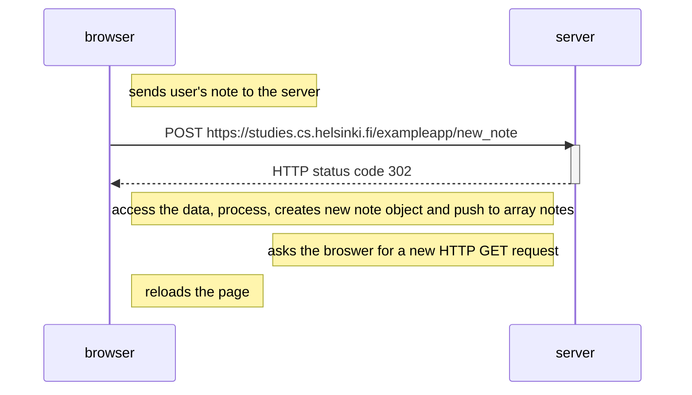

```mermaid
sequenceDiagram
    participant browser
    participant server

    Note right of browser: sends user's note to the server
    browser->>server: POST https://studies.cs.helsinki.fi/exampleapp/new_note
    activate server
    server-->>browser: HTTP status code 302
    deactivate server
    Note left of server: access the data, process, creates new note object and push to array notes
    Note left of server: asks the broswer for a new HTTP GET request
    Note right of browser: reloads the page
```
