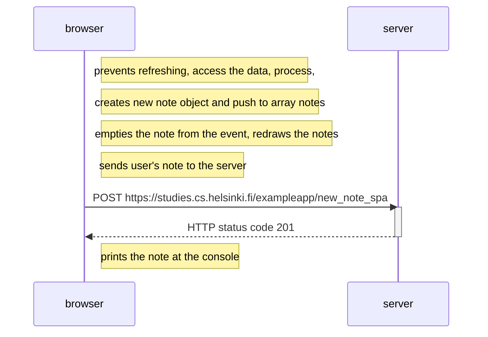

```mermaid
sequenceDiagram
    participant browser
    participant server
    
    Note right of browser: prevents refreshing, access the data, process,
    Note right of browser: creates new note object and push to array notes
    Note right of browser: empties the note from the event, redraws the notes
    Note right of browser: sends user's note to the server
    browser->>server: POST https://studies.cs.helsinki.fi/exampleapp/new_note_spa
    activate server
    server-->>browser: HTTP status code 201
    deactivate server
    Note right of browser: prints the note at the console
```
